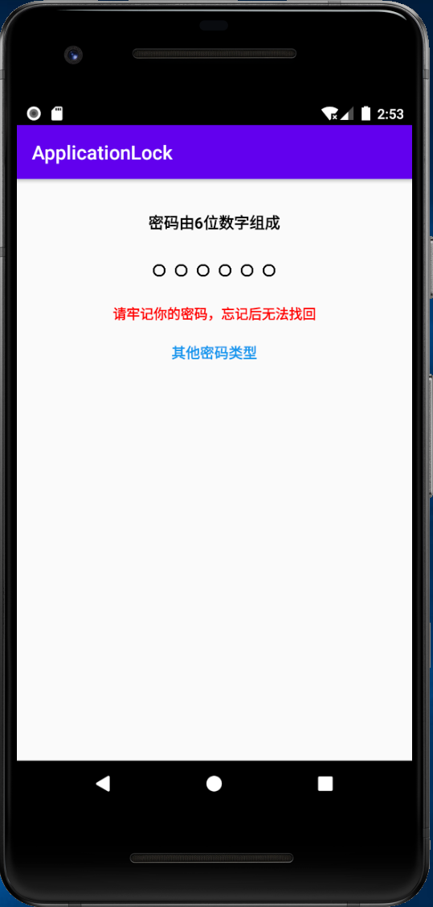
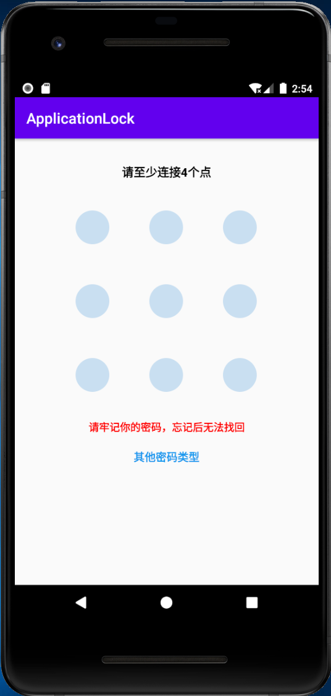
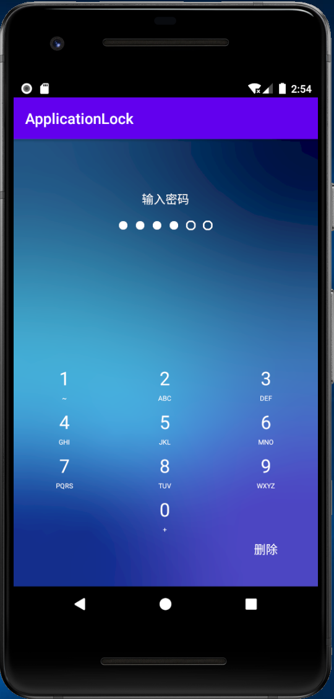
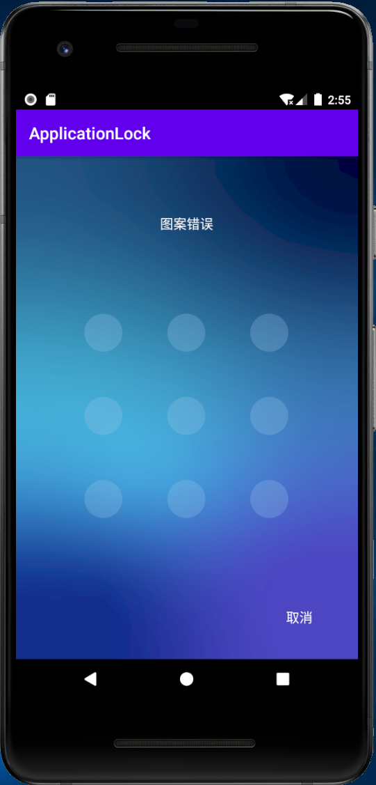
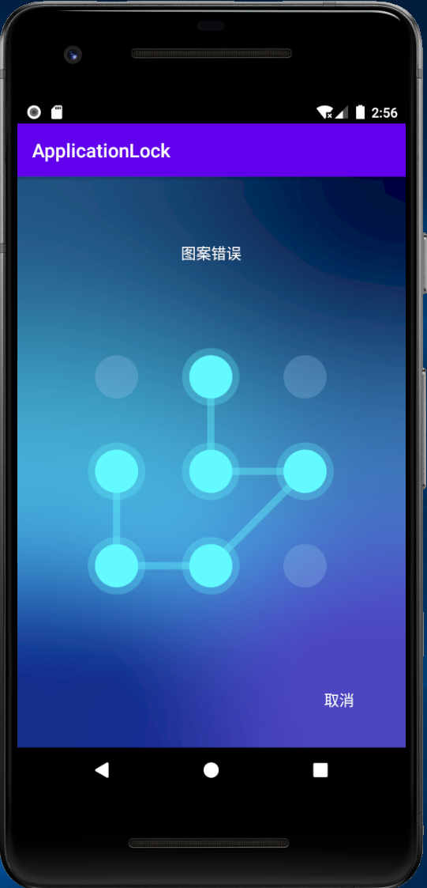

# ApplicationLock  
Implementing application locks  
实现了应用锁功能，支持数字密码和图形密码  
  
## 效果展示  
1.设置密码锁界面  
  
|设置数字密码|设置图案密码|  
|:---:|:---:|  
|||  
  
2、解锁界面  
|数字解锁界面|图案解锁界面|图案绘制界面|  
|:---:|:---:|:---:|  
||||  
  
## 使用说明  
应用在设置密码锁之后，只有应用再完全退出后（后台也要退出），再进入的时候才会弹出解锁界面  